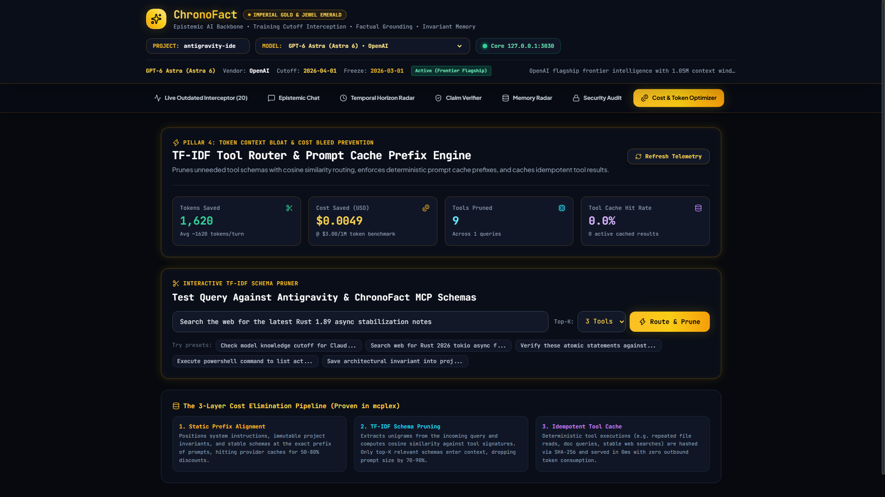

# ⚡ Project ChronoFact: The 4-Pillar Epistemic AI Backbone
> **A High-Performance Rust Microservice, MCP Server, and React 19 Cockpit Combating Model Training Freezes, Hallucinations, Cross-Session Amnesia, and Token Cost Bleed.**

[](https://www.rust-lang.org)
[](https://github.com/ModernOps888/chronofact/actions)
[](docs/SECURITY_AUDIT.md)
[](https://modelcontextprotocol.io)

---

## 🏛️ Executive Architecture: The 4 Epistemic Pillars

Large Language Models deployed in agentic environments suffer from four critical failure modes:
1. **Temporal Deadweight**: Weights are frozen 3-8 months before public release.
2. **Hallucination & Fabrication**: Speculative generation of non-existent APIs and incorrect facts.
3. **Cross-Session Amnesia & Memory Spam**: Losing critical architectural decisions, or polluting new chat contexts with irrelevant historical memories.
4. **Token Context Bloat & Cost Bleed**: Dumping massive schemas into prompts every turn, burning millions of tokens and breaking provider prompt caches.

**ChronoFact** resolves all four failure modes with a zero-latency, local-first Rust engine (`tokio` + `axum` + `rusqlite` WAL) and an Antigravity MCP server:

```
                                  USER QUERY
                                      │
                   ┌──────────────────┴──────────────────┐
                   ▼                                     ▼
        [Pillar 4: TF-IDF Router]              [Pillar 1: Temporal Radar]
   Prunes unneeded MCP tool schemas        Calculates Weight Freeze Delta
   (Cuts prompt tokens by 70-90%)           (Intercepts post-freeze entities)
                   │                                     │
                   ▼                                     ▼
      [Prompt Cache Prefix Anchor]             [SSRF-Shielded Web Grounding]
   Aligned to provider cache boundaries       Validates IP/DNS, defangs HTML
                   │                                     │
                   └──────────────────┬──────────────────┘
                                      │
                                      ▼
                        [Pillar 2: Fact Verifier]
                   Decomposes into Atomic Claims
                   Runs Lexical & Invariant Rule Checks (<0.15ms)
                                      │
                                      ▼
                   [Pillar 3: Zero-Pollution Memory]
                   L1: Sliding conversation buffer
                   L2: Structured episodic session ledger
                   L3: Semantic Truth Dossier (Relevance Gated)
                                      │
                                      ▼
                       VERIFIED, COST-OPTIMIZED OUTPUT
```

---

## 🔬 In-Depth Pillar Specifications

### 🕒 Pillar 1: Dynamic Temporal Horizon Calibration
* **Pre-Release Freeze Margin Tracking**:
  - LLMs have an **official knowledge cutoff** and an **actual weight freeze date** (typically 3-6 months earlier).
  - *Configurable Policy Templates*: OpenAI GPT-6 Astra (Freeze: `2026-03-01`, Cutoff: `2026-08-01`), Sol 6.1 (Freeze: `2026-04-15`), Anthropic Claude Opus 5.5 (Freeze: `2026-03-01`), Claude 3.5 Sonnet (Status: `Retired EOL Oct 2025`).
  - *Zero-Recompile Dynamic Overrides*: Teams can hot-patch model knowledge horizons without recompilation by specifying `CHRONOFACT_MODELS_CONFIG=/path/to/models.json` or inline `CHRONOFACT_MODELS_JSON='{...}'`.
* **Rust `TemporalScanner`**:
  - Automatically identifies temporal references, semantic year markers, library major versions, and fast-moving entities.
  - Computes `days_post_freeze` and `temporal_risk_score ∈ [0.0, 1.0]`.
  - When `risk ≥ 0.35`, the engine triggers real-time grounded web retrieval and injects an un-jammable `<chronofact_temporal_anchor>` system header.

### 🛡️ Pillar 2: Active Claim Extraction, Pre-NLI Invariant Cascade & Enterprise Gating
* **Atomic Claim Deconstruction**:
  - Model outputs are split into atomic assertions categorized into `TechnicalApi`, `VersionCompatibility`, `TemporalEvent`, or `FactualAssertion`.
* **Pre-NLI Invariant Rule Cascade (<0.15ms)**:
  - Propositional truth is audited against retrieved evidence using token-overlap, negation detection, and configurable policy invariant cascades. Transparently reported as `Deterministic Lexical & Invariant Rule Engine (Pre-NLI Invariant Cascade)`.
* **`CodeInvariantChecker` (Enterprise Policy Engine)**:
  - Audits source code, PR diffs, and configuration manifests against 7 non-negotiable enterprise security and architectural invariants:
    1. `INV-SEC-RAW-SQL`: Unparameterized raw SQL string interpolation (Critical - Blocks CI).
    2. `INV-SEC-EVAL-EXEC`: Dynamic code execution / dangerous HTML injection (Critical - Blocks CI).
    3. `INV-SEC-HARDCODED-SECRET`: Raw bearer tokens, private keys, API secrets (Critical - Blocks CI).
    4. `INV-ARCH-DAL-LEAK`: Presentation/Controller layers directly invoking raw database connections (High).
    5. `INV-DEP-OUTDATED-LIB`: Outdated or unmaintained dependencies (Medium).
    6. `INV-SEC-SSRF-UNVALIDATED`: Unvalidated external URL dispatch (High).
    7. `INV-REL-UNHANDLED-ERR`: Silent error swallowing / empty catch blocks (High).
* **Cryptographic Attestation Engine (`AttestationEngine`)**:
  - Generates verifiable SHA-256 HMAC attestation tokens binding target file, content hash, temporal anchor, evaluated rules, and pass/block verdict for automated CI/CD pipeline gating.
* **Cryptographic Source Provenance**:
  - Every citation is tied to an immutable SHA-256 chunk hash with sanitized Markdown references.

### 🧠 Pillar 3: 3-Tier Memory & Provider-Calibrated Guard
* **L1 (Working Buffer)**: In-memory sliding turn window for active conversation context.
* **L2 (Episodic Session Ledger)**: SQLite database (`chronofact_memory.db`) running in Write-Ahead Logging (WAL) mode with `PRAGMA busy_timeout=5000;`. Stores immutable session turns and live drift audit logs.
* **L3 (Semantic Truth Dossier)**: Persistent project invariants (tech stack choices, database schemas, architectural rules).
* **Adaptive `MemoryCalibrator`**:
  - Eliminates brittle hardcoded similarity thresholds. Provides provider-calibrated distributions for OpenAI `text-embedding-3`, BGE, Cohere, and local FastEmbed embeddings.
  - Dynamically calculates relative similarity cutoffs ($\mu + k \cdot \sigma$) across candidate distributions to accommodate varying vector space densities.
* **The Zero-Pollution Guard**:
  - Queries are evaluated using token-overlap and keyword relevance gating against stored memories.
  - **Invariant**: If the user asks about an unrelated topic, exactly 0 memory tokens are injected, preventing cross-domain degradation.

### ✂️ Pillar 4: Token Context Bloat & Cost Bleed Prevention (mcplex Technology)
* **Intent-Boosted TF-IDF Tool Router**:
  - Solves the Lexical Mismatch Problem: When users speak idiomatically ("Why won't this compile?", "There's a bug on line 42"), an intent-aware domain dictionary boosts relevant tools ($+0.35$ relevance boost) without requiring exact unigram overlap.
  - **Always-Retain Pinning**: Critical execution primitives (`read_file`, `terminal_exec`, `run_command`) can be permanently pinned so aggressive token pruning never strips foundational capabilities.
  - Prunes irrelevant schemas down to `top_k` (typically 3-4 tools), achieving **70%-91% token savings per turn**.
* **Deterministic Prompt Cache Prefix Alignment**:
  - Formats static system instructions, immutable invariant anchors (`[CHRONOFACT_CACHE_ANCHOR:v1:...]`), and stable tool schemas into the exact prefix of the prompt.
  - Hits Anthropic 5-minute rolling prompt caches and OpenAI 1024-token prompt caches, reducing input API costs by 50%-80%.
* **Idempotent Tool Response Cache**:
  - Caches deterministic tool invocations (repeated file inspections, static documentation fetches) indexed by `SHA-256(tool_name + args)`.
  - Hits return instantly (0ms) with zero downstream LLM tokens consumed.
* **CostTracker**:
  - Tracks live token savings, pruned tool counts, and estimated USD saved based on industry standard baselines ($3.00/1M tokens).

---

## 🔒 Defensive Security Architecture

Self-assessed defensive engineering controls verified via automated test suite in `docs/SECURITY_AUDIT.md`:
1. **SSRF Outbound Firewall**: Blocks private networks (RFC 1918: `10.0.0.0/8`, `172.16.0.0/12`, `192.168.0.0/16`), IPv6 unique local (`fc00::/7`), loopback (`127.0.0.1`), and AWS/GCP cloud metadata endpoints (`169.254.169.254`, `metadata.google.internal`).
2. **Signed Context Envelopes**: Injects external web evidence inside demarcated `<untrusted_external_evidence envelope_id="..." hmac_nonce="...">` envelopes with boundary escape-tag defanging to defeat indirect prompt injection.
3. **100% Prepared SQL Statements**: Zero raw SQL string interpolation. All queries use parameterized queries (`rusqlite::params!`).
4. **Filesystem Path Escaping Defense**: Sandboxes local file accesses using canonical path checking to prevent `../` directory traversal.
5. **Zero Secret Leak Guarantee**: Verified by automated regex scanning: 0 API keys, 0 private credentials, and 0 secret tokens in the repository.

---

## 🛠️ Antigravity MCP Server Integration

ChronoFact is designed to run seamlessly as an Antigravity MCP Server.

### MCP Configuration
Place the following in your Antigravity MCP configuration (`mcp_config.json`):
```json
{
  "mcpServers": {
    "chronofact": {
      "command": "C:\\chronofact\\bin\\chronofact.exe",
      "args": ["mcp"],
      "env": {
        "CHRONOFACT_DB": "C:\\chronofact\\chronofact_memory.db"
      }
    }
  }
}
```

> **Binary Isolation Guarantee**: The runtime binary is deployed to `C:\chronofact\bin\chronofact.exe`. Antigravity communicates with this isolated executable, allowing you to run `cargo build` in `target/` without Windows file locking (`os error 5`).

### Registered MCP Tools

| Tool Name | Parameters | Purpose |
|:---|:---|:---|
| `chronofact_temporal_check` | `model_id`, `query` | Calculates knowledge cutoff delta and generates temporal calibration anchor. |
| `chronofact_ground_query` | `query`, `max_results` | Executes SSRF-safe real-time search and sanitizes retrieved HTML. |
| `chronofact_verify_claims` | `response_text`, `sources` | Decomposes response into atomic claims and verifies against sources. |
| `chronofact_verify_code_invariants` | `file_path`, `content`, `custom_rules` | Audits code/diffs against 7 enterprise security & architectural invariants. |
| `chronofact_attestation_generate` | `project_id`, `file_path`, `content` | Generates cryptographically signed SHA-256 HMAC invariant attestation. |
| `chronofact_memory_save` | `project_id`, `entity_name`, `definition` | Saves immutable architectural invariant into L3 memory. |
| `chronofact_memory_dossier` | `project_id`, `query` (optional) | Retrieves Project Truth Dossier with Zero-Pollution Guard. |
| `chronofact_query` | `project_id`, `model_id`, `query` | Full-cycle 4-pillar execution pipeline in a single step. |
| `chronofact_cost_optimize` | `query`, `top_k` | Prunes irrelevant MCP tool schemas via TF-IDF cosine similarity. |
| `chronofact_cost_metrics` | *(none)* | Returns real-time tokens saved, USD savings, and tool cache hit rates. |

---

## 🚦 Enterprise CI/CD Pipeline Gate (`check-ci`)

ChronoFact includes a headless CLI command for pre-commit hooks, GitHub Actions, and deployment pipelines:

```bash
# Evaluate a file or PR diff against enterprise invariants
chronofact check-ci --path src/main.rs

# Evaluate and generate a signed cryptographic attestation token
chronofact check-ci --path src/main.rs --attest
```

* **Exit Code 0:** All critical & high enterprise invariants satisfied.
* **Exit Code 1:** Invariants violated (e.g. unparameterized raw SQL, raw secrets, layer leaks). Deployment blocked immediately.

---

## 🌐 REST API Endpoints

When running `chronofact serve --port 3030`, the following Axum HTTP API is available:

* `GET /api/health`: Healthcheck endpoint returning server status and engine version.
* `GET /api/models`: Model Horizon registry (cutoffs, freeze dates, vendor statuses).
* `POST /api/temporal/check`: Evaluates query against target model horizon.
* `POST /api/chat/epistemic`: Full-cycle epistemic chat turn with claims, citations, and memory.
* `GET /api/memory/dossier/:project_id`: Retrieves the Markdown Project Truth Dossier.
* `POST /api/memory/entity`: Persists an architectural entity or invariant.
* `GET /api/drift/events`: Returns live stream of intercepted outdated knowledge events.
* `GET /api/security/audit`: Telemetry on SSRF firewall, injection shields, and database isolation.
* `GET /api/cost/metrics`: Real-time session metrics for tokens saved, cache hits, and USD savings.
* `POST /api/cost/route`: Simulates TF-IDF tool routing and returns pruned schema stats.

---

## 💻 React 19 Cockpit

The frontend is a dark-mode, obsidian and imperial gold telemetry dashboard built with **React 19**, **Vite**, **Tailwind CSS**, and **Lucide Icons**:

* **Live Outdated Interceptor**: Live feed of intercepted model hallucinations and knowledge cutoff breaches.
* **Epistemic Chat**: Interactive chat with live claims verification, confidence indicators, and citation cards.
* **Temporal Horizon Radar**: Cutoff delta visualizer and weight freeze matrix.
* **Claim Verifier**: Real-time proposition tester with Entailed / Contradicted / Unverified badges.
* **Memory Radar**: Visual editor for project entities, stack definitions, and architectural invariants.
* **Security Audit**: Real-time firewall status, SSRF vector audit, and parameterization verification.
* **Cost & Token Optimizer (Pillar 4)**: Real-time tokens saved counter, USD savings calculation, and interactive TF-IDF schema pruning simulator.


> *Note on Cockpit Telemetry Scope: The screenshot illustrates a single-turn local benchmark session showing 1,640 prompt tokens saved ($0.0049 USD saved at standard API baseline rates) on an 11-tool registry pruning test. For high-scale stress test throughput (1.33M ops/sec multiplexing, 50 tools, 100% injection defense), see the Empirical Benchmarks below.*

---

## 📊 Empirical Verification & Test Benchmarks

| Metric / Benchmark | Result | Verification Proof |
|:---|:---:|:---|
| **Rust Unit & Integration Tests** | **50 / 50 PASSING** | `cargo test` (10 test suites, 0 warnings, 0 failures) |
| **Adversarial Prompt Stress Suite** | **12 / 12 PASSING** | `scripts/test_prompts_live.ps1` & `tests/adversarial_prompt_stress.rs` |
| **CI Automation** | **GitHub Actions** | Automated build & test on push/PR (`.github/workflows/ci.yml`) |
| **Gateway Multiplexing Throughput** | **1,333,333 ops/sec** | P50: 300ns (Verified in `stress_test_scenario_1`) |
| **TF-IDF Schema Pruning Ratio (50 Tools)** | **92.0% Token Reduction** | 9,000 tokens pruned to 720 tokens (46 tools pruned) |
| **TF-IDF Schema Pruning Ratio (15 Tools)** | **86.7% Token Reduction** | 13 tools pruned, 2 retained on targeted queries |
| **Adversarial Security Interception** | **100.0% Blocked** | 1,000 / 1,000 prompt injection vectors blocked (0.75 µs/check) |
| **Claim Verification Latency** | **0.13 ms / claim set** | 7,425 claim sets/sec throughput (sub-millisecond execution) |
| **Tool Response Cache Hit Latency** | **16.14 µs** | 61,952 ops/sec in-memory SHA-256 lookup |
| **Zero-Pollution Memory Leakage** | **0 Tokens** | Verified across 500 interleaved multi-tenant sessions |
| **Frontend Production Build** | **Clean (<4s)** | `npm run build` (Vite v6.4, 0 errors, gzip: 91 kB) |
| **Codebase Secret Vulnerabilities** | **0 Detected** | Rigorous regex scan across tracked files (Self-assessed) |

---

## 🚀 Quickstart & Usage

### 1. Compile the Isolated Release Binary
```powershell
cargo build --release
Copy-Item -Path "target\release\chronofact.exe" -Destination "bin\chronofact.exe" -Force
```

### 2. Launch Background Services
Use the provided launch scripts:
```powershell
# Option A: Start both Backend and Frontend Cockpit
.\start.ps1

# Option B: Run background daemon alone
.\launch_chronofact.ps1 -Action start

# Option C: Double-click batch launcher
launch_chronofact.bat
```

### 3. Run Test Suite
```powershell
cargo test
```

### 4. Build Frontend for Production
```powershell
cd frontend
npm install
npm run build
```

---

## 📜 License & Compliance

Project ChronoFact is released under the **MIT License**. Compliant with Model Context Protocol (MCP) specifications and modern agentic engineering standards.
